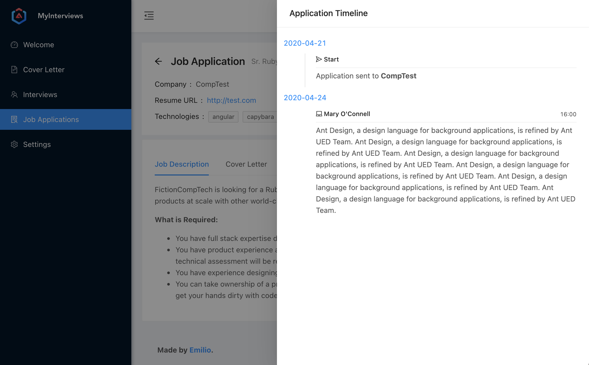

myinterviews 
=============
[](https://heroku.com/deploy)
[](https://github.com/emilio2hd/myinterviews)
[](https://travis-ci.org/emilio2hd/myinterviews)
[](https://codebeat.co/projects/github-com-emilio2hd-myinterviews-master)

The goal of this app is to manage job applications, interviews, cover letters and feedbacks.
 

Do you wanna see the demo? [Click here!](https://myinterviews.herokuapp.com/)
 
# Docker
You can run the application using Docker.

The container has the port **3000** exposed.

The application does not contain a database, so you must inform the database info via environment variables.

### Build container

To build an image of the application, execute:
```
docker build -t myinterviews .
```

### Environment Variables

* **APP_DB_HOST** - The database's host address
* **APP_DB_PORT** - The database's port
* **APP_DB_USER** - The database's username
* **APP_DB_PASSWORD** - The database's password
* **SECRET_KEY_BASE** - The secret key is required to run in production mode

### Docker-compose
Here is an example of a docker-compose.yml file:

```yml
db:
  image: postgres:9.4
  container_name: myinterviews-db
  restart: always
  ports:
    - "5432:5432"
  environment:
    - POSTGRES_USER=db_user
    - POSTGRES_PASSWORD=123456
    - POSTGRES_DB=myinterviews
web:
  container_name: myinterviews-web
  restart: always
  build: .
  ports:
    - "3000:3000"
  environment:
    - APP_DB_HOST=db
    - APP_DB_PORT=5432
    - APP_DB_USER=db_user
    - APP_DB_PASSWORD=123456
    - SECRET_KEY_BASE=ef8705c8be8bc5c562fd403847e1451d8e149ba4bf88dea34c7e0c99fc55556d3ea3e0619b24ff7399f19c3c0e7798b62ffe643e8a6911cee982e7143ef0e262
  links:
    - db
```

# Vagrant
If you know nothing about docker or you're not willing to install it, you can use VirtualBox + Vagrant.  
Run: `vagrant up`
You might wanna go get a cup of coffee or watch something, because it's gonna take a while to complete.

After it's finished, you will see something like:
```shell
~~~ LOG ~~~
...
==> default: Creating myinterviews-db
==> default: Creating myinterviews-web
```
Using a browser, go to **http://192.168.33.101:3000** and you'll see the dashboard (or at least you should).

**Warning**: The shell script creates a docker-compose.yml at /opt/myinterviews/docker-compose.yml with
a default `SECRET_KEY_BASE`, so please, do generate another key, replace it at docker-compose.yml and restart the web containers.  
You can generate another key by executing:
```
vagrant ssh
cd /opt/myinterviews/
docker exec -it myinterviews-web bash -lc "rake secret"
# Copy the generated secret
vi docker-compose.yml
# Replace the SECRET_KEY_BASE value and save
docker-compose restart web
```
 
In case something goes wrong, execute:
```
vagrant ssh
cd /opt/myinterviews
docker-compose logs
```
To see the logs of docker

### Update the Application
To update your application execute:
```
vagrant provision --provision-with update_app
```

# Email Configuration
My Interviews has support to send emails by smtp only.  
:warning: Note: As of July 15, 2014, Google increased [its security measures](https://support.google.com/accounts/answer/6010255) 
and now blocks attempts from apps it deems less secure.

# Contributions
If you want to contribute, open a issue or send me a pull request. ;)